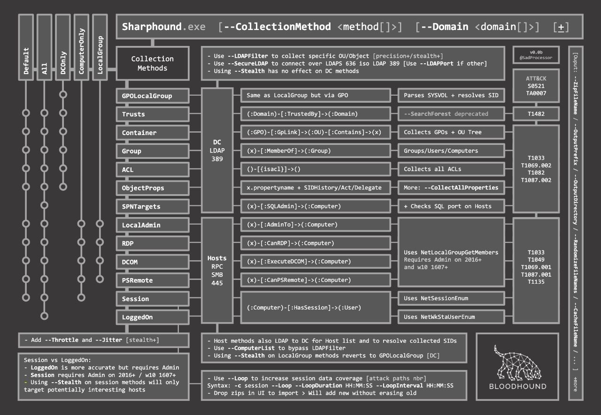

# Enable Sharp-Hound
## Supply data to BloodHound
The generated archive can be uploaded to the BloodHound application.
```powershell
. .\SharpHound.ps1
Invoke-BloodHound -CollectionMethod All,LoggedOn
```

## To avoid detections like ATA
```powershell
Invoke-BloodHound -CollectionMethod All -ExcludeDC
```



---

## Neo4j
## Start neo4j and BloodHound UI on kali machine and load the zip/json files
```bash
sudo neo4j console&;bloodhound&
```


